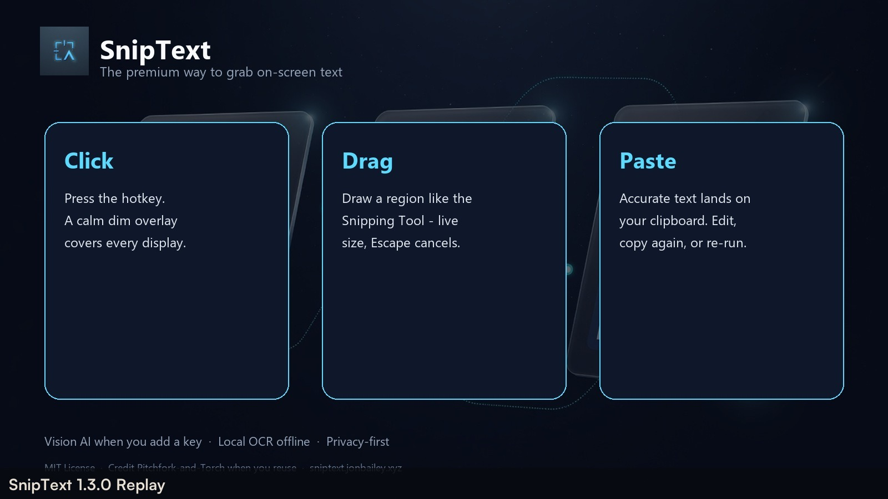

# SnipText

**Snip. Read. Clipboard.**

Premium desktop utility: snip any on-screen region and get **accurate text on your clipboard** - like Snipping Tool, but the deliverable is text, not a PNG.

[](https://github.com/Pitchfork-and-Torch/SnipText/releases/latest)
[](https://sniptext.jonbailey.xyz/)
[](LICENSE)
[](NOTICE)

**Product site / download:** https://sniptext.jonbailey.xyz/  
**Windows release (EXE):** https://github.com/Pitchfork-and-Torch/SnipText/releases/latest

---

## The best part

1. **Click** - global hotkey (`Ctrl+Shift+T` by default)
2. **Drag** - multi-monitor selection with live dimensions
3. **Paste** - transcribed text is already on your clipboard

Optional editable preview. Vision AI when you connect a key. Local OCR when you are offline.

## Features

- Multi-monitor, high-DPI capture
- Modular engines: xAI Grok vision (default), OpenAI, Anthropic, Google, RapidOCR / Paddle / Easy / Tesseract
- Tray app: Clip Desk (search, pin, copy, export/import a local JSON ledger), Replay last snip (`Ctrl+Shift+R`), Connect AI, delay snip, settings
- Startup banner; Windows single-instance (second launch opens Settings)
- Hotkey recorder, Start with Windows, privacy-first keys (OS keyring when available)
- MIT open source with **required attribution** (see [NOTICE](NOTICE))

## Download (Windows)

**Current package: v1.3.0 Replay** (replay last region hotkey; Clip Desk ledger still ships)

1. Open the [latest release](https://github.com/Pitchfork-and-Torch/SnipText/releases/latest)
2. Download `SnipText-Windows-portable.zip`
3. Extract the whole folder and run `SnipText.exe` (keep `_internal` next to the exe)
4. Tray icon + short "running" banner - hotkey `Ctrl+Shift+T` or tray **New snip**

API keys are stored under your user app data / OS credential store - **never inside the EXE**.

## Brand assets

| Asset | Path |
|-------|------|
| App icon (ICO) | [`assets/icon.ico`](assets/icon.ico) |
| App icon (PNG) | [`assets/icon.png`](assets/icon.png) |
| Logo 512 | [`brand/logo-512.png`](brand/logo-512.png) |
| Infographic | [`brand/infographic-landscape.jpg`](brand/infographic-landscape.jpg) |
| Tweet / OG card | [`brand/tweet-card-1200x630.jpg`](brand/tweet-card-1200x630.jpg) |



## Install from source

```bash
python -m pip install -r requirements.txt
python -m pip install -r requirements-local.txt   # local OCR (recommended)
python -m sniptext
```

Python 3.11+ (3.13: use `rapidocr-onnxruntime==1.2.3` as pinned in `requirements-local.txt`).

## Connect your own LLM key

Tray → **Connect AI (max accuracy)...**

| Provider | Get a key |
|----------|-----------|
| xAI (Grok) recommended | https://console.x.ai/ |
| OpenAI | https://platform.openai.com/api-keys |
| Anthropic | https://console.anthropic.com/settings/keys |
| Google Gemini | https://aistudio.google.com/apikey |

Paste → **Test connection** → done. Mode defaults to *AI when available*.

## License and credit

**MIT License** - free to use, modify, and redistribute.

If you copy the code, ship a derivative, or reuse substantial portions, you **must**:

1. Keep the copyright notice and MIT license text
2. Credit **Pitchfork-and-Torch** in a reasonable user-visible place

See [LICENSE](LICENSE) and [NOTICE](NOTICE) for the full attribution requirement.

Suggested credit:

```text
SnipText by Pitchfork-and-Torch (https://github.com/Pitchfork-and-Torch/SnipText)
```

## Packaging

```powershell
# Windows portable folder (PyInstaller onedir + RapidOCR when available)
powershell -ExecutionPolicy Bypass -File .\scripts\build-windows.ps1
```

## Project layout

```text
sniptext/     application
landing/      sniptext.jonbailey.xyz static site
brand/        logo, OG card, infographic
scripts/      run, build, brand compose
assets/       app icon
```

## Support

Use [GitHub Issues](https://github.com/Pitchfork-and-Torch/SnipText/issues). No personal contact required.

---

Made by [Pitchfork-and-Torch](https://github.com/Pitchfork-and-Torch) · https://jonbailey.xyz/
